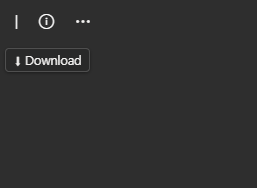
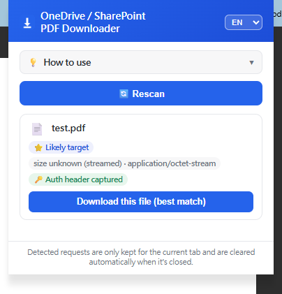

**English** | [繁體中文](./README.zh-TW.md)

# OneDrive / SharePoint PDF Download Unlocker (Browser Extension)

Last updated: 2026-06-26 (version 1.0.0)

## What this is

A Chrome / Edge extension (Manifest V3) that bypasses OneDrive / SharePoint's "preview only, no download" restriction and saves the PDF to your computer in one click.

### The problem

Many organizations and schools configure OneDrive / SharePoint so uploaded PDFs are "preview only": there's no download button on the page at all, or it's been removed by permissions/layout. The file content is still transmitted to the browser through some network request (just wrapped in a format meant for the online viewer), so in principle it's always possible to save it — there's just no ready-made entry point.

Before this extension, the only way to save the file was:

1. Open DevTools (F12) → switch to the Network tab.
2. Reload the page and dig through dozens of network requests to find the one that actually carries the file content (the URL is usually long and full of tokens, nearly impossible to spot by eye).
3. Copy that request's URL and the required headers (e.g. `Referer`, `X-SPOPacToken` and other auth headers — missing any of them gets the request blocked).
4. Re-issue the request with something like PowerShell's `Invoke-WebRequest` and save the response body as a file.

This had to be redone for every single file, and required knowing how to use DevTools, how to pick out the right request, and how to reattach the right auth headers — well beyond what an average user can do, and tedious/error-prone even for technical users (miss one header, or the token expires, and you start over).

### How this extension solves it

The extension continuously watches network requests as the tab loads, automatically finding the one that actually carries the file content (no manual digging through the Network tab needed). Because it runs at the browser-extension level, the auth headers and tokens that used to require manual copying are carried along automatically — the user never has to deal with them. Once detected, a download button floats onto the page; clicking it saves the file straight to the local Downloads folder under its original filename. The whole workflow goes from "DevTools + PowerShell" technical know-how down to "see a button on the page, click it."

## Screenshots

| Download button on the preview page | Popup showing a detected candidate file |
| --- | --- |
|  |  |

## Installation

Not published on the Chrome Web Store yet — install it as an unpacked extension:

1. Go to this repo's [Releases](../../releases) page and download the latest `onedrive-pdf-download-unlocker.zip`, then unzip it (or just clone/download this repo's source directly).
2. Open Chrome (or Edge) and go to `chrome://extensions` (`edge://extensions` on Edge).
3. Turn on "Developer mode" in the top right.
4. Click "Load unpacked" and select the unzipped folder (it should contain `manifest.json` directly).
5. Once installed, open an OneDrive / SharePoint PDF preview page to test — you should see the floating download button appear.

## How it works

- Listens to network requests as OneDrive / SharePoint pages load (`webRequest` / `webNavigation`), looking for the one request that actually carries the PDF/document content (matched by URL keywords such as `passthrough`, `download.aspx`, `getfilebycontent`, `allowlistfiletype`).
- Once a candidate file is detected, a floating `position: fixed` download button appears on the page, positioned live via `getBoundingClientRect()` near the toolbar or the native download button, without overlapping the native UI.
- Clicking the button saves the captured content straight to the Downloads folder under its original filename.

## Features

1. **Multi-language UI**: defaults to English, switchable to Chinese in the popup, applied instantly.
2. **Adaptive dark/light theme**: automatically picks a matching color scheme based on the brightness behind the button, so text stays readable.
3. **Doesn't block native UI**: the button is anchored below its reference element; if the anchor container measures an abnormal height, it automatically falls back to a capped-height position to avoid drifting into unrelated areas.
4. **Auto-reset on same-tab file switch**: uses `onHistoryStateUpdated` + a 600ms debounce to determine whether the file actually changed, avoiding false positives from internal URL normalization during the same file's load.
5. **Keyboard accessible**: both the download button and the close button can be operated with Tab / Enter / Space.
6. **Still shows the button when no candidate is found yet**: displays a disabled "no PDF detected" state (after a 3-second grace period) instead of looking unresponsive.
7. **`host_permissions` covers the Microsoft domains actually used**: besides the original five domains, adds `svc.ms` (the backend that actually serves file content — without it, share-link pages with no native download button go undetected), `mcas.ms` (a security proxy used by some enterprises/schools), sign-in domains, and static-asset domains, instead of a blanket `*://*/*`.
8. **The close button never gets in the way, and is never unreachable**: hidden by default, fades in when the mouse is over the download or close button, and fades out 0.3s after the mouse leaves (giving the cursor time to move across); Tab focus also reveals it correctly (controlled via `opacity` rather than `display:none`, since the latter is unreachable by keyboard focus entirely).
9. **Fixed a feedback loop where the floating button "drifted downward" on its own**: the selector used to find the page's "native download button" could previously mistake the extension's own injected button for a native one (because its own `aria-label` text also contains the word "Download"), causing each reposition pass to use itself as the anchor and drift further down without stopping. The selector now explicitly excludes the extension's own injected node.

## File structure

- `manifest.json` - extension configuration
- `background.js` - listens to network requests, detects candidate files, handles same-tab file-switch reset (with debounce logic)
- `content.js` - injects the floating download button into the page, including positioning, theme detection, accessibility, and close-button visibility logic
- `i18n.js` - Chinese/English string dictionary + language persistence
- `popup.js` / `popup.html` - the popup shown when clicking the extension icon (language switcher, list of candidate files)
- `icons/` - extension icons
- `PRIVACY.md` - bilingual (Chinese/English) privacy policy
- `LICENSE` - MIT license
- `CHANGELOG.md` - version history

## Versions & downloads

Source code lives directly in this repo's root. Every official release also gets a packaged `onedrive-pdf-download-unlocker.zip` attached on the [Releases](../../releases) page, for anyone who'd rather not clone the source. See [CHANGELOG.md](./CHANGELOG.md) for version history.

## Delivery status

Current version: 1.0.0. All `.js` files have passed syntax checks, the manifest has been validated, the zip contents have been verified to match the source, and it has been manually tested in a real browser. If you run into any issues, please report them via Issues.

## License

This project is licensed under the [MIT License](./LICENSE).

## Known limitations / things to watch for later

- Currently only covers Microsoft's global commercial cloud (`*.sharepoint.com` etc.), not sovereign clouds (`.sharepoint.us` / `.cn` / `.de`). May need additions if you're on a different tenant environment in the future.
- Detection relies on URL keyword matching; if Microsoft changes the URL format of these endpoints in the future, `URL_KEYWORDS` (in `background.js`) may need updating.
