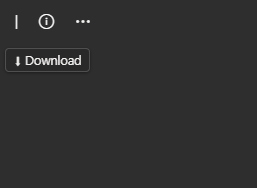
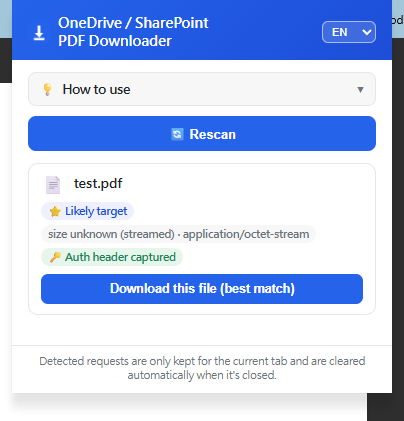

**English** | [繁體中文](./README.zh-TW.md)

# OneDrive / SharePoint PDF Download Unlocker (Browser Extension)

Last updated: 2026-09-30 (version 1.2.0)

## What this is

A browser extension (Manifest V3) for Chrome, Edge, and Firefox that bypasses OneDrive / SharePoint's "preview only, no download" restriction and saves the PDF to your computer in one click.

Since **1.2.0** it also exports **PowerPoint-for-web slides** (Chrome / Edge): it captures a "view-only / block-download" — or even sensitivity-labelled — deck slide by slide into an image-based PDF (plus a text file). See the "PowerPoint slide export" section below.

### The problem

Many organizations and schools configure OneDrive / SharePoint so uploaded PDFs are "preview only": there's no download button on the page at all, or it's been removed by permissions/layout. The file content is still transmitted to the browser through some network request (just wrapped in a format meant for the online viewer), so in principle it's always possible to save it — there's just no ready-made entry point.

Before this extension, the only way to save the file was:

1. Open DevTools (F12) → switch to the Network tab.
2. Reload the page and dig through dozens of network requests to find the one that actually carries the file content (the URL is usually long and full of tokens, nearly impossible to spot by eye).
3. Copy that request's URL and the required headers (e.g. `Referer`, `X-SPOPacToken` and other auth headers — missing any of them gets the request blocked).
4. Re-issue the request with something like PowerShell's `Invoke-WebRequest` and save the response body as a file.

This had to be redone for every single file, and required knowing how to use DevTools, how to pick out the right request, and how to reattach the right auth headers — well beyond what an average user can do, and tedious/error-prone even for technical users (miss one header, or the token expires, and you start over).

### How this extension solves it

The extension continuously watches network requests as the tab loads, automatically finding the one that actually carries the file content (no manual digging through the Network tab needed). Because it runs at the browser-extension level, the auth headers and tokens that used to require manual copying are carried along automatically — the user never has to deal with them. Once detected, a download button floats onto the page; clicking it saves the file straight to the local Downloads folder under its original filename. The whole workflow goes from "DevTools + PowerShell" technical know-how down to "see a button on the page, click it."

## Screenshots

| Download button on the preview page | Popup showing a detected candidate file |
| --- | --- |
|  |  |

## Installation

Not published on any store yet — install it as an unpacked / temporary extension.

### Chrome / Edge

1. Go to this repo's [Releases](../../releases) page and download the latest `onedrive-pdf-download-unlocker-chrome.zip`, then unzip it (or just clone/download this repo's source directly).
2. Open Chrome (or Edge) and go to `chrome://extensions` (`edge://extensions` on Edge).
3. Turn on "Developer mode" in the top right.
4. Click "Load unpacked" and select the unzipped folder (it should contain `manifest.json` directly).
5. Once installed, open an OneDrive / SharePoint PDF preview page to test — you should see the floating download button appear.

> Note: the extension declares the `debugger` permission (needed for high-resolution PowerPoint slide capture). Chrome / Edge will ask you to confirm it on install or update (an update may disable the extension until you click "Enable"). While exporting slides, the browser shows a "is debugging this browser" bar — this is normal.

### Firefox (temporary load)

Firefox uses a separate package (`onedrive-pdf-download-unlocker-firefox.zip`) because it needs a different `background` manifest key than Chrome. The zip already ships the correct `manifest.json`, so just:

1. Download `onedrive-pdf-download-unlocker-firefox.zip` from [Releases](../../releases) and unzip it.
2. Go to `about:debugging#/runtime/this-firefox`.
3. Click "Load Temporary Add-on…" and select the `manifest.json` inside the unzipped folder.
4. Open an OneDrive / SharePoint PDF preview page to test.

> Note: a temporary add-on is removed when you restart Firefox. Permanent installation on regular Firefox requires a Mozilla-signed build (via addons.mozilla.org), which isn't available yet — for now, reload it after each restart.

### Building the zips yourself

Run `build.ps1` (PowerShell) to produce both zips under `dist/`:

```powershell
powershell -ExecutionPolicy Bypass -File build.ps1
```

It packages the Chrome zip from `manifest.json` and the Firefox zip with `manifest.firefox.json` renamed to `manifest.json` automatically.

## How it works

- Listens to network requests as OneDrive / SharePoint pages load (`webRequest` / `webNavigation`), looking for the one request that actually carries the PDF/document content (matched by URL keywords such as `passthrough`, `download.aspx`, `getfilebycontent`, `allowlistfiletype`).
- Once a candidate file is detected, a floating `position: fixed` download button appears on the page, positioned live via `getBoundingClientRect()` near the toolbar or the native download button, without overlapping the native UI.
- Clicking the button saves the captured content straight to the Downloads folder under its original filename.

## PowerPoint slide export (Chrome / Edge)

Beyond PDF downloads, 1.2.0 adds exporting decks opened in **PowerPoint for the web** — ideal for "view-only / block-download" or sensitivity-labelled decks where you can't get the original `.pptx` (e.g. a teacher archiving locked lesson slides).

### How to use

1. Open the deck in PowerPoint for the web (the `officeapps.live.com` viewer, or a PowerPoint link on SharePoint).
2. Start it either way:
   - the orange **"Export slides (PDF)"** button at the bottom-right of the page; or
   - click the extension icon, pick a quality in the popup, and press **"Export slides (PDF)"** — press **"Text"** for text only.
3. Progress shows at the bottom-left of the viewer. When done, two files land in your Downloads folder: an image-based PDF and a `.txt` of each slide's text.

### Highlights

- **Faithful layout**: captures the actual rendered slide at high resolution, so text (CJK included), shapes, tables and charts sit exactly where they do online.
- **Selectable, remembered quality**: Standard (1600px, small file), High (2000px), Max (2560px, near-print — automatically capped at your display's native resolution to avoid upscaling artefacts).
- **No clutter in the capture**: hides the "Click to add…" placeholder prompts and dashed boxes, and dismisses the "you don't have permission to edit" toast so it isn't captured.
- **Keyboard navigation, capture-when-ready**: advances slide by slide with arrow keys and waits for each slide to finish rendering (images included) before capturing, avoiding torn or skipped slides.

### The `debugger` permission

High-resolution capture goes through Chrome's debugger API, so the extension declares the `debugger` permission. While exporting, Chrome shows a "is debugging this browser" bar at the top — this is **expected and required**, and disappears when the export finishes.

### Notes

- **Arc** only allows "from-surface" screenshots, so each capture briefly flashes the window in and out of fullscreen. That's an Arc limitation — **Chrome / Edge don't flash**, so prefer them for exporting.
- **Firefox is not supported** for slide export (no debugger API); PDF download still works.
- If you also have a "force enable right-click / copy" extension installed (e.g. *Absolute Enable Right Click & Copy*), it constantly re-scans PowerPoint-for-web's ever-changing DOM and drags down the whole browser and the export — disable it while exporting.

## Features

1. **Multi-language UI**: defaults to English, switchable to Chinese in the popup, applied instantly.
2. **Adaptive dark/light theme**: automatically picks a matching color scheme based on the brightness behind the button, so text stays readable.
3. **Doesn't block native UI**: the button is anchored below its reference element; if the anchor container measures an abnormal height, it automatically falls back to a capped-height position to avoid drifting into unrelated areas.
4. **Auto-reset on same-tab file switch**: uses `onHistoryStateUpdated` + a 600ms debounce to determine whether the file actually changed, avoiding false positives from internal URL normalization during the same file's load.
5. **Keyboard accessible**: both the download button and the close button can be operated with Tab / Enter / Space.
6. **Still shows the button when no candidate is found yet**: displays a disabled "no PDF detected" state (after a 3-second grace period) instead of looking unresponsive.
7. **`host_permissions` covers the Microsoft domains actually used**: besides the original five domains, adds `svc.ms` (the backend that actually serves file content — without it, share-link pages with no native download button go undetected), `mcas.ms` (a security proxy used by some enterprises/schools), sign-in domains, and static-asset domains, instead of a blanket `*://*/*`.
8. **The close button never gets in the way, and is never unreachable**: hidden by default, fades in when the mouse is over the download or close button, and fades out 0.3s after the mouse leaves (giving the cursor time to move across); Tab focus also reveals it correctly (controlled via `opacity` rather than `display:none`, since the latter is unreachable by keyboard focus entirely).
9. **Fixed a feedback loop where the floating button "drifted downward" on its own**: the selector used to find the page's "native download button" could previously mistake the extension's own injected button for a native one (because its own `aria-label` text also contains the word "Download"), causing each reposition pass to use itself as the anchor and drift further down without stopping. The selector now explicitly excludes the extension's own injected node.
10. **Large files are no longer capped at 64 MiB** (issue #1): files over 8 MB are handed from the background script to the page in 8 MB chunks instead of one giant message, so the browser's ~64 MiB message limit no longer applies (tested up to 400 MB).
11. **Works on Chrome, Edge and Firefox**: Firefox uses its own package (see Installation) with the background-script setup Firefox requires.
12. **PowerPoint slide export (Chrome / Edge)**: captures view-only / block-download decks slide by slide into an image-based PDF plus a text file, with selectable quality, started from an on-page button or the popup (see the section above).

## File structure

- `manifest.json` - extension configuration (Chrome / Edge)
- `manifest.firefox.json` - Firefox manifest variant (`background.scripts` instead of a service worker; renamed to `manifest.json` at package time)
- `build.ps1` - packaging script that produces the Chrome and Firefox zips under `dist/`
- `background.js` - listens to network requests, detects candidate files, handles same-tab file-switch reset (with debounce logic), and streams large downloads in chunks
- `content.js` - injects the floating download button into the page, including positioning, theme detection, accessibility, and close-button visibility logic
- `i18n.js` - Chinese/English string dictionary + language persistence
- `popup.js` / `popup.html` - the popup shown when clicking the extension icon (language switcher, candidate file list, slide export + quality options)
- `slides.js` - the PowerPoint-for-web slide export core (keyboard navigation, render waiting, per-slide capture, text extraction)
- `slidepdf.js` - assembles the captured JPEGs into an image-based PDF
- `icons/` - extension icons
- `PRIVACY.md` - bilingual (Chinese/English) privacy policy
- `LICENSE` - MIT license
- `CHANGELOG.md` - version history

## Versions & downloads

Source code lives directly in this repo's root. Every release also gets packaged zips (`-chrome.zip` and `-firefox.zip`) attached on the [Releases](../../releases) page, for anyone who'd rather not clone the source. See [CHANGELOG.md](./CHANGELOG.md) for version history.

## Delivery status

Current version: **1.2.0**.

- All `.js` files pass syntax checks and load/execute without errors.
- **PowerPoint slide export (new in 1.2.0):** developed and tuned across many rounds of real-device testing (macOS + Arc / Chrome) since beta.1. Keyboard navigation, render waiting, per-slide capture and PDF/text output are verified on a 50-slide deck; all three quality presets and the on-page button trigger are verified.
- **Large-file download (issue #1):** tested end-to-end in Chromium against a mock SharePoint server that requires the `X-SPOPacToken` header, via both the floating button and the popup, at 8 MB, just over 8 MB, 70 MB, 150 MB and 400 MB. Every download came out byte-for-byte identical to the original. The same 70 MB test hangs on v1.0.0, which reproduces the original bug.
- **Firefox (issue #2):** confirmed working by the user who requested it (slide export excepted — not supported on Firefox).
- Please report problems (browser, file size, what happened) via Issues.

The v1.0.0 release remains available on the [Releases](../../releases) page as a fallback.

## License

This project is licensed under the [MIT License](./LICENSE).

## Known limitations / things to watch for later

- Currently only covers Microsoft's global commercial cloud (`*.sharepoint.com` etc.), not sovereign clouds (`.sharepoint.us` / `.cn` / `.de`). May need additions if you're on a different tenant environment in the future.
- Detection relies on URL keyword matching; if Microsoft changes the URL format of these endpoints in the future, `URL_KEYWORDS` (in `background.js`) may need updating.
- Slide export flashes fullscreen on each capture in Arc (Arc only allows from-surface screenshots); Chrome / Edge don't. Firefox doesn't support slide export.
- Slide export currently produces an image-based PDF, with text saved separately as `.txt`. **Planned (next release):** a selectable/copyable invisible text layer, and higher-than-native output via `deviceScaleFactor` (dsf).
