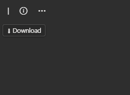
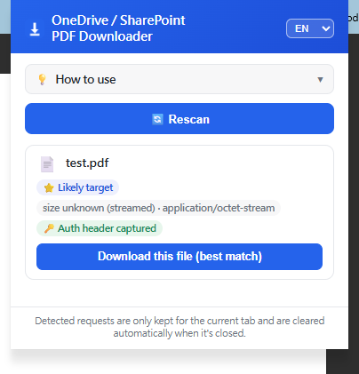

[English](./README.md) | **繁體中文**

# OneDrive / SharePoint PDF 下載限制繞過工具（瀏覽器擴充功能）

最後更新：2026-09-24（版本 1.1.0）

## 這是什麼

一個瀏覽器擴充功能（Manifest V3，支援 Chrome、Edge、Firefox），用來繞過 OneDrive、SharePoint「只能線上預覽、不給下載」的限制，一鍵把 PDF 存到本機。

### 要解決的問題

很多機關／學校的 OneDrive / SharePoint 環境會把上傳的 PDF 設成「只能線上預覽」，網頁上完全沒有下載按鈕，或者下載按鈕被權限/版面設計拿掉了。但檔案內容其實還是有透過某個網路請求傳到瀏覽器（只是被包成線上檢視器用的格式），所以理論上一定能存下來，只是沒有現成的入口。

在這個擴充功能之前，存檔的唯一辦法是：

1. 開瀏覽器開發人員工具（F12）→ 切到 Network 分頁。
2. 重新整理頁面，在一堆網路請求裡找出真正帶有檔案內容的那一個（網址通常很長、夾雜 token，肉眼很難一眼認出來）。
3. 複製該請求的網址跟必要的 headers（例如 `Referer`、`X-SPOPacToken` 等驗證用標頭，少了會被擋）。
4. 改用 PowerShell 的 `Invoke-WebRequest` 之類的指令重新發送請求，把回應內容存成檔案。

這個流程每次要存一個檔案都要重做一次，而且需要懂開發人員工具、懂怎麼挑出正確的請求、懂怎麼補上驗證標頭，一般使用者根本做不到，對技術人員來說也很瑣碎、容易出錯（標頭少貼一個、token 過期就要重來）。

### 這個擴充功能怎麼解決

擴充功能在背景持續監看分頁載入的網路請求，自動找出「真正帶有檔案內容」的那個請求（不用人工翻 Network 分頁），並且因為是在瀏覽器擴充功能的層級運作，原本要手動補的驗證標頭、token 都會自動帶著，不需要使用者自己處理。偵測到之後，會在頁面上浮出一個下載按鈕，點一下就直接把檔案內容存到本機「下載」資料夾，用的還是原始檔名。整套操作從「開發人員工具 + PowerShell」的技術門檻，簡化成「看到頁面上多一顆按鈕，點一下」。

## 畫面截圖

| 預覽頁面上的下載按鈕 | 偵測到候選檔案的彈出視窗 |
| --- | --- |
|  |  |

## 安裝方式

目前未上架任何商店，請用「載入未封裝／臨時項目」的方式安裝。

### Chrome / Edge

1. 到本專案的 [Releases](../../releases) 頁面，下載最新版的 `onedrive-pdf-download-unlocker-chrome.zip` 並解壓縮（或直接 clone/下載這個 repo 的原始碼）。
2. 開啟 Chrome（或 Edge），網址列輸入 `chrome://extensions`（Edge 為 `edge://extensions`）。
3. 右上角開啟「開發人員模式」。
4. 點「載入未封裝項目」，選擇剛剛解壓縮出來的資料夾（裡面要能直接看到 `manifest.json`）。
5. 安裝完成後，到 OneDrive / SharePoint 的 PDF 預覽頁面測試，應該會看到浮出的下載按鈕。

### Firefox（臨時載入）

Firefox 需要跟 Chrome 不同的 `background` manifest 設定，所以用另一個打包檔（`onedrive-pdf-download-unlocker-firefox.zip`）。該 zip 內已附上正確的 `manifest.json`，直接：

1. 從 [Releases](../../releases) 下載 `onedrive-pdf-download-unlocker-firefox.zip` 並解壓縮。
2. 網址列輸入 `about:debugging#/runtime/this-firefox`。
3. 點「載入臨時附加元件…」，選擇解壓後資料夾裡的 `manifest.json`。
4. 到 OneDrive / SharePoint 的 PDF 預覽頁面測試。

> 注意：臨時附加元件在**重開 Firefox 後就會消失**。要在一般版 Firefox 永久安裝，需經 Mozilla（addons.mozilla.org）簽章，目前尚未提供；在那之前，每次重開 Firefox 後需重新載入一次。

### 自行打包

執行 `build.ps1`（PowerShell）即可在 `dist/` 產出兩個 zip：

```powershell
powershell -ExecutionPolicy Bypass -File build.ps1
```

它會用 `manifest.json` 打 Chrome 版，並自動把 `manifest.firefox.json` 改名成 `manifest.json` 打 Firefox 版。

## 核心運作方式

- 監聽 OneDrive / SharePoint 頁面載入時的網路請求（`webRequest` / `webNavigation`），找出真正帶有 PDF/文件內容的那一個請求（用網址關鍵字判斷，例如 `passthrough`、`download.aspx`、`getfilebycontent`、`allowlistfiletype`）。
- 偵測到候選檔案後，在頁面上浮出一個 `position: fixed` 的懸浮下載按鈕（用 `getBoundingClientRect()` 即時定位在工具列下方或原生下載按鈕旁，不會跟原生 UI 重疊）。
- 點擊按鈕後，直接把抓到的內容存成本機檔案（用原始檔名）到下載資料夾。

## 已完成的功能

1. **多語言介面**：預設英文，popup 可切換中文，即時生效。
2. **深色/淺色主題自適應**：依按鈕周圍背景亮度自動套用對應配色，確保文字看得到。
3. **不擋原生 UI**：按鈕定位在錨點下方；錨點容器量到異常高度時會自動改用上限高度定位，避免跑到不相關的區域。
4. **同分頁切換檔案自動重置**：用 `onHistoryStateUpdated` + 600ms 防抖判斷是否真的換檔，避免同一檔案載入時的內部 URL 正規化被誤判成換檔。
5. **鍵盤可及性**：下載按鈕與關閉鈕都可用 Tab / Enter / 空白鍵操作。
6. **找不到候選檔案時仍顯示按鈕**：標示「未偵測到 PDF」的停用狀態（3 秒寬限期），不會看起來像沒反應。
7. **`host_permissions` 涵蓋實際會用到的微軟網域**：除原本五個網域外，加入 `svc.ms`（實際傳送檔案內容的後端服務，缺少會偵測不到沒有原生下載按鈕的分享連結頁面）、`mcas.ms`（部分企業/學校用的安全代理）、登入網域與靜態資源網域，不用 `*://*/*`。
8. **關閉鈕不會擋路、也不會點不到**：平常不顯示，滑鼠移到下載按鈕或關閉鈕上才淡入，移開後延遲 0.3 秒才淡出，讓滑鼠有時間移過去；Tab 鍵聚焦也會正常顯示（用 `opacity` 而不是 `display:none` 控制，否則鍵盤完全聚焦不到）。
9. **修掉懸浮按鈕「自己往下跑」的回授迴圈**：搜尋「頁面上原生下載按鈕」的選擇器，原本可能誤把擴充功能自己注入的按鈕當成原生按鈕（因為自己的 `aria-label` 文字裡也含有「Download」字樣），導致每次重新定位都把自己當錨點、越跑越下面、停不下來。現在搜尋時會明確排除自己注入的節點。
10. **大型檔案不再受 64 MiB 限制**（issue #1）：超過 8 MB 的檔案改成每塊 8 MB 分批從背景傳到頁面，不再一次塞進單一訊息，因此不受瀏覽器約 64 MiB 的訊息上限影響（實測到 400 MB）。
11. **支援 Chrome、Edge、Firefox**：Firefox 使用獨立的安裝包（見「安裝方式」），內含 Firefox 需要的背景腳本設定。

## 檔案結構

- `manifest.json` - 擴充功能設定（Chrome / Edge）
- `manifest.firefox.json` - Firefox 版 manifest（用 `background.scripts` 取代 service worker；打包時會改名成 `manifest.json`）
- `build.ps1` - 打包腳本，在 `dist/` 產出 Chrome 與 Firefox 兩個 zip
- `background.js` - 監聽網路請求、偵測檔案、處理同分頁換檔重置（含防抖邏輯）、大型檔案分塊傳輸
- `content.js` - 在頁面注入懸浮下載按鈕，含定位、主題判斷、a11y、關閉鈕顯示邏輯
- `i18n.js` - 中英文字串字典 + 語言儲存/讀取
- `popup.js` / `popup.html` - 點擊擴充功能圖示彈出的視窗（含語言切換、候選檔案清單）
- `icons/` - 擴充功能圖示
- `PRIVACY.md` - 中英雙語隱私權政策
- `LICENSE` - MIT 授權條款
- `CHANGELOG.md` - 版本變更紀錄

## 版本與下載

原始碼直接放在這個 repo 的根目錄；每個版本會在 [Releases](../../releases) 頁面附上打包好的 zip（`-chrome.zip` 與 `-firefox.zip`），方便不想 clone 原始碼的人直接下載安裝。版本紀錄請見 [CHANGELOG.md](./CHANGELOG.md)。

## 交付狀態

目前版本 **1.1.0**。

- 所有 `.js` 檔通過語法檢查，載入執行無錯誤。
- **大型檔案下載（issue #1）**：在 Chromium 中對一個「必須帶 `X-SPOPacToken` 標頭才給檔案」的模擬 SharePoint 伺服器做端對端測試，浮動按鈕與 popup 兩條路徑都測過，檔案大小涵蓋 8 MB、略超過 8 MB、70 MB、150 MB、400 MB，下載結果與原檔逐位元組完全一致。同樣的 70 MB 測試在 v1.0.0 會卡住，重現了原本的問題。
- **Firefox（issue #2）**：已由提出需求的使用者確認可正常使用。
- 遇到問題請透過 Issues 回報（瀏覽器、檔案大小、發生什麼狀況）。

v1.0.0 仍保留在 [Releases](../../releases) 頁面，可作為退回的備援版本。

## License

本專案採用 [MIT License](./LICENSE)。

## 已知限制 / 後續可能要注意的事

- 目前只覆蓋微軟全球商用雲（`*.sharepoint.com` 等），不含主權雲（`.sharepoint.us` / `.cn` / `.de`），若未來換到不同租戶環境可能需要再補。
- 偵測邏輯靠網址關鍵字比對，若微軟未來改變這些端點的網址格式，可能需要更新 `URL_KEYWORDS`（在 `background.js`）。
